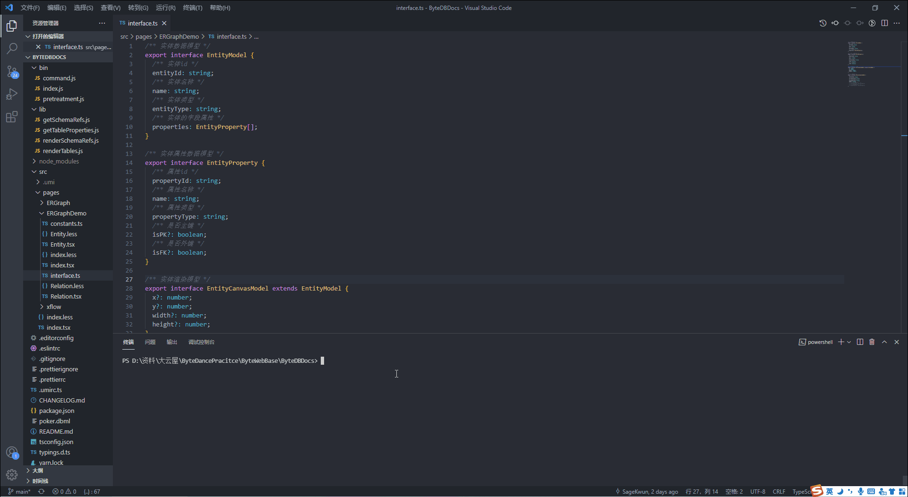
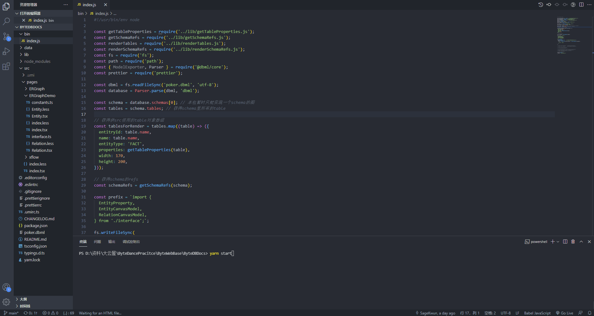

# ByteWebBase


为了最大程度的让组员参与进来，我们选择了 ByteWebBase 面向 Web 前端研发的基础设施作为项目的方向，包含 ByteDBDocs、ByteApiCLI、ByteApiTestTool、ByteVitePressCLI、ByteGitStat、ByteWebMonitor 六大部分。

(以下仓库将在 9 月 26 日 12:00 对外开放~)

[1. ByteDBDocs 管善鑫 张群清 xxx ](https://github.com/ByteWebBase/ByteDBDocs)

[2. ByteApiCLI 胡文兴 xxx xxx](https://github.com/ByteWebBase/ByteDBDocs)

[3. ByteApiTestTool 司徒永聪 xxx xxx](https://github.com/ByteWebBase/ByteApiTestTool)

[4. ByteVitePressCLI 杨嘉兴 xxx xxx](https://github.com/ByteWebBase/ByteVitePressCLI)

[5. ByteGitStat 陈池轩 xxx xxx](https://github.com/ByteWebBase/ByteGitStat)

[6. ByteWebMonitor](https://byte-web-monitor.vansin.top/)

[答辩 PPT 地址](https://fyctfmijjr.feishu.cn/file/boxcnLU57KRENXh2W9WuDVe4Npb)

## 平台架构


## [1. ByteDBDocs](https://github.com/ByteWebBase/ByteDBDocs)

dbml 数据库表格配置文件生成数据库可视化表格

### 开发流程思路

1. 通过包读取.dbml 文件并得到 db 对象
2. 根据 db 对象生成`mock.ts`
3. 将`mock.ts`加入模板中，并使用`antv x6`进行可视化渲染

### 实现效果

编译


启动服务


打开界面


### 参考资料

[antv x6](https://x6.antv.vision/zh/docs/tutorial/about)

[DBML api](https://www.dbml.org/js-module/#api)

## [2. ByteApiCLI](https://github.com/ByteWebBase/ByteApiCLI)

dbml 配置文件生成 Restful 接口 Koa 工程

### Github OAuth 登录

Github OAuth 登录后才能使用脚手架的其他功能，便于自动收集脚手架用户的使用情况

### pre-commit 代码审查


## [3. ByteApiTestTool](https://github.com/ByteWebBase/ByteApiTestTool)

Api 测试工具——用注释包围关键代码即可调试 免去频繁复制粘贴所带来的麻烦

[](https://imgtu.com/i/4ymWUP)

## [4. ByteVitePressCLI](https://github.com/ByteWebBase/ByteVitePressCLI)

### 特性

- 🚀: **快速构建**：几行命令，高效开发
- 🔗: **约定路由**：支持侧边栏文章路由自动生成
- 🌟: **一键部署**：支持轻服务页面托管一键部署
- 👁‍🗨: **一键监控**：支持 `Byte-Web-Monitor` 监控一键配置
  
### 介绍

这是一个轻量级的vitepress脚手架，初始化项目时你可以通过参数选取语言模板，其特色是可以一键部署到字节跳动旗下的云产品————[轻服务](https://qingfuwu.cn/)、支持[Byte-Web-Monitor](https://byte-web-monitor.vansin.top/)的页面监控服务，以及支持中文模板下的约定路由生成。

### 安装
```
$ npm install byte-vitepress-cli -g
```
### 使用
在控制台输入以下命令生成中文模板:
```
$ byte-vitepress-cli init myproject
```
在控制台输入以下命令生成多语言支持（中英）的模板:
```
$ byte-vitepress-cli init myproject -e
```

### 命令与参数

#### init <PROJECT_NAME> [LANGUAGE_OPTIONS]
通过该命令初始化你的vitepress中文项目
```
$ byte-vitepress-cli init myproject 
```
或者中英文项目
```
$ byte-vitepress-cli init myproject -e
```
#### refresh
通过该命令自动生成你的vitepress项目的侧边栏路由，目前暂时仅支持中文模板下的约定路由生成。

进入你的 `VitePress` 项目根目录，输入如下命令，便可自动配置你的侧边栏文章路由信息。

```bash
$ byte-vitepress-cli refresh
```

约定路由格式如下：

```
xxx-{weight}.md
```

其中 `xxx` 为文件名，同时也是显示在页面中的侧边栏名，`{weight}` 为文章优先级，越小则越靠前。

示例图如下：

- 文件命名示例
  


- 实际效果示例
  


#### upgrade
检查是否有版本更新
```
$ byte-vitepress-cli upgrade
```

#### service <service_ID> \<credentials>
通过该指令生成你的云服务配置信息。

你可以在你个人的[轻服务](https://qingfuwu.cn/)控制台设置中查看到对应的service_ID。

个人凭证的申请可以参考如下链接: [personal_ credentials](https://qingfuwu.cn/docs/openapi/personaltoken2.html)
```
$ byte-vitepress-cli service aaabbb abcdefxyz
```

#### monitor <APP_ID>
添加页面监控的app_id信息

你可以在[Byte-Web-Monitor](https://byte-web-monitor.vansin.top/)中申请一个app_id，并通过命令配置你的监控信息。
```
$ byte-vitepress-cli monitor example123
```

#### addMonitor 
为你的项目增加页面监控功能，由[Byte-Web-Monitor](https://byte-web-monitor.vansin.top/)提供监控支持。

在增加该配置之前，请确保你已通过`monitor`指令配置了你的监控配置信息。

除此之外，你还得运行 `npm run build` 指令将你的项目打包后，方可进行监控配置。

注意，若要使用该功能，请在**页面部署前**在你的命令行中输入该命令。
```
$ byte-vitepress-cli addMonitor
```
#### deploy
将你的项目部署到字节跳动旗下产品————[轻服务](https://qingfuwu.cn/)上。

在部署之前，请确保你已通过`service`指令配置了你的云服务配置信息。

除此之外，你还得运行 `npm run build` 指令将你的项目打包后，方可进行部署。
```
$ byte-vitepress-cli deploy
```

#### mirror <TEMPLATE_MIRROR>
你可以替换模板的下载位置如下指令：
```
$ byte-vitepress-cli mirror https://moonstarimg.oss-cn-hangzhou.aliyuncs.com/template/
```
**注意**  
你可以自己定制模板的镜像下载地址，但请确保该地址下拥有两种模板，模板的名字必须是 `template.zip` 或 `template-en.zip`, 并且镜像链接应以 `/` 结尾，否则将会出现模板下载的情况。  
举个例子，你的镜像地址为 `https://example.com/mirror/template.zip` 或 `https://example.com/mirror/template-en.zip`。
镜像配置的时候应当输入 `https://example.com/mirror/`  

当你修改了镜像后，最初的模板也会随之删除，若你仍需要最初的模板，你可以到如下链接中下载：[byte-vitepress-cli](https://github.com/YoungX99/byte-vitepress-cli). 

## [5. ByteGitStat](https://github.com/ByteWebBase/ByteGitStat)

Git 相关数据统计工具

## [6. ByteWebMonitor](https://byte-web-monitor.vansin.top/)

Web 前端监控一站式解决方案

<!--  -->


